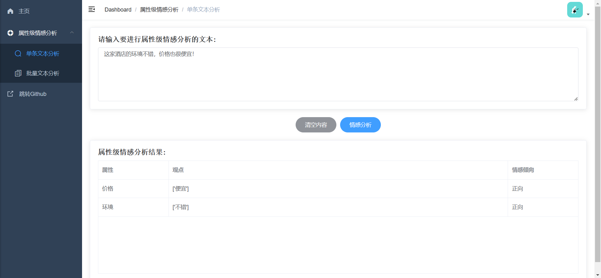
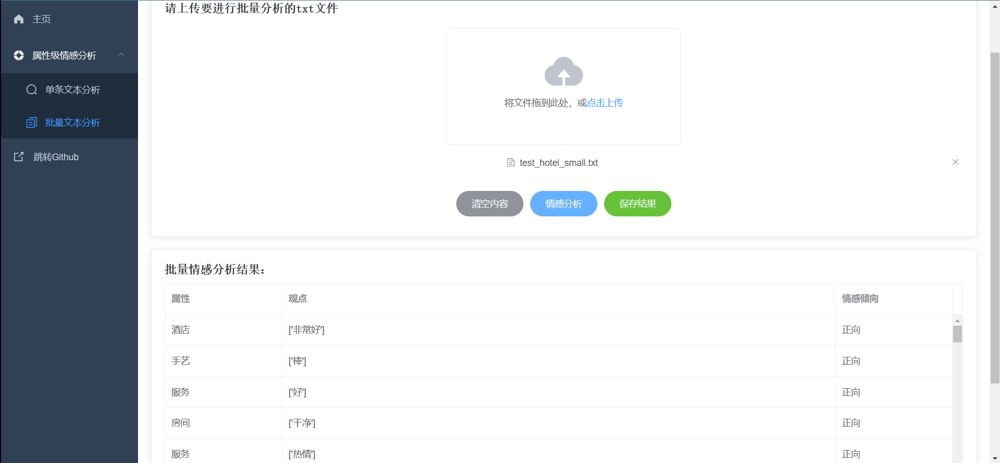
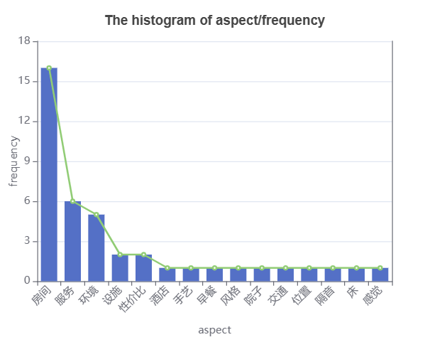
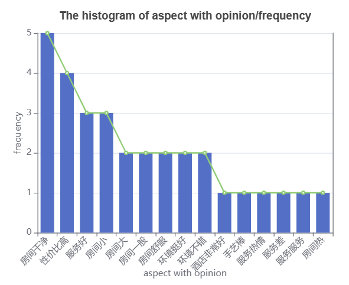
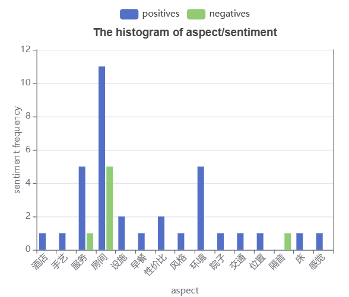

# 项目名称：基于UIE的舆论情感分析Web系统


项目教程：https://aistudio.baidu.com/aistudio/projectdetail/5857236

Github项目地址：https://github.com/JIANG-HS/UIE-SentimentAnalysisWeb

演示视频传送门： https://www.bilibili.com/video/BV1ug4y1g71L/?spm_id_from=333.999.0.0&vd_source=18c1d4290ab8e6f5101b518491603fc3

# 一. 项目简介
基于UIE的舆论情感分析Web系统，前后端分离式架构部署，支持单文本属性级情感分析及上传txt文件进行批量情感分析，并支持分析结果的可视化展示。
技术栈：后端：FastAPI + UIE；前端：Vue + ElementUI + Echarts。

# 二. 项目目录结构   

项目采用前后端分离式架构，分为frontend和backend两个文件夹

* backend文件夹为后端接口服务模块，demo.py为模型预测演示程序，main.py为后端接口服务主程序，utils.py定义一些工具函数。
* frontend文件夹为情感分析系统前端界面模块，基于 vue-admin-template进行开发。 核心关注src/router/index.js和src/views/两大模块，router中定义了界面路由即侧边栏选项框及映射关系，views文件夹下为搭建的新Web界面，包含欢迎页、单文本情感分析界面和批量文本情感分析界面。

# 三. 项目环境配置
## 3.1 后端服务环境配置

首先需要下载安装Python包管理器Anaconda：https://mirrors.tuna.tsinghua.edu.cn/anaconda/archive/
访问镜像下载网站，根据自己电脑系统（win64或Linux等）选择合适的版本，建议选择较新的版本。

配置清华源镜像加速

```bash
conda config --add channels https://mirrors.tuna.tsinghua.edu.cn/anaconda/pkgs/free/
conda config --add channels https://mirrors.tuna.tsinghua.edu.cn/anaconda/pkgs/main/
conda config --set show_channel_urls yes
```

创建新虚拟环境便于隔离，环境名为paddlepaddle，python版本为3.7

```bash
conda create -n paddlepaddle python=3.7
```

进入刚才创建的虚拟环境paddlepaddle，需注意后续环境配置操作都将在该环境中进行配置！！！

```bash
activate paddlepaddle
```

下载paddle，建议安装GPU版本性能更优。简化配置的话也可以选择下载CPU版本
paddle官网下载地址（根据型号等进行选择）：
https://www.paddlepaddle.org.cn/install/quick?docurl=/documentation/docs/zh/install/pip/linux-pip.html
若安装GPU版本需要先配置cuda和cudnn，参考教程：
https://aistudio.baidu.com/aistudio/projectdetail/696822?channelType=0&channel=0
下面给出PaddlePaddle 2.3 CPU版本 Windows下pip的下载命令（具体建议以官网提供的为准）：

```bash
python -m pip install paddlepaddle==2.3.2 -i https://pypi.tuna.tsinghua.edu.cn/simple
```

paddle测试是否安装成功，在命令行中依次输入：

```python
python
import paddle
paddle.utils.run_check()
```

若提示 “PaddlePaddle is installed successfully!” 则安装成功！

下载最新版PaddleNLP，若出现不兼容问题可以考虑指定版本降级

```bash
pip install --upgrade paddlenlp
```

下载后端依赖Web框架FastAPI

```bash
pip install fastapi
pip install "uvicorn[standard]"
pip install python-multipart
```

下载pandas读取excel文件依赖库
```bash
pip install openpyxl
```

启动后端项目：
通过cd命令进行项目backend文件夹，运行demo演示程序进行测试
```bash
python demo.py
```

通过cd命令进行项目backend文件夹，启动后端接口服务！
```bash
python main.py
```
ps:  初次启动会进行一次模型预测操作进行预热，时间会稍久些但可有效提高后续接口访问的性能。看到“Application startup complete”和“Uvicorn ruuning on http:127.0.0.1:8000”代表后端项目启动成功

接口调试可以下载安装Postman软件便于后端Restful API接口的访问测试。
Postman使用参考：https://mp.weixin.qq.com/s/IoseF-2Ma8mH2gdQLn1rUA

## 3.2  前端项目环境配置：

建议下载个前端IDE便于调试，推荐使用VS Code！由于项目添加了eslint代码标准化审查，建议在VS Code插件市场下载vue和eslint插件。

安装node.js，因项目需要使用到npm管理包！！！
参考：https://m.php.cn/article/483528.html

通过cd命令进行项目frontend文件夹，安装项目所需依赖
```bash
npm install
```

启动前端项目
```bash
npm run dev
```
ps:看到App running at:Local: http://localhost:9528代表项目启动成功。此时访问http://localhost:9528即可进入情感分析Web系统

## 3.3 项目使用说明

特别注意要完整访问项目的话，前端和后端项目都要启动哦！！！

1. 单文本情感分析：单文本情感分析界面输入框内输入要进行情感分析的文本，点击情感分析按钮进行情感分析预测。

	

2. 批量文本情感分析：批量文本情感分析界面选择要上传的txt文件。 选择上传文件后点击情感分析按钮进行批量情感分析预测。

	

3. 分析结果可视化：一共有六种可视化图形，分别为：“属性频率词云图”、”属性频率柱状图”、”属性+观点词云图”、”属性+观点柱状图”、”属性+情感词云图”和”属性+情感柱状图”

	

	

	

	   

# 四.参考学习资料：

1. FastAPI官方文档：https://fastapi.tiangolo.com/zh/
2. Postman使用教程：https://mp.weixin.qq.com/s/IoseF-2Ma8mH2gdQLn1rUA
3. Vue官方文档：https://v3.cn.vuejs.org/
4. ElementUI文档：https://v3.cn.vuejs.org/
5. vue-admin-template：https://github.com/PanJiaChen/vue-admin-template
6. ECharts：https://echarts.apache.org/zh/index.html

# 五.项目反馈：
项目运行过程中遇到问题欢迎在项目评论区（https://aistudio.baidu.com/aistudio/projectdetail/5857236）留言反馈。

联系作者： 若遇到较难解决问题可以添加qq：1090272686联系作者，注意提供完整报错信息和截图便于定位和解决问题。


